# 🍳 PrepPal

Welcome to **PrepPal** — your ultimate recipe companion! This is a portfolio project designed to help food lovers **explore**, **save**, and **share** delicious recipes from around the world.

Whether you're a passionate home cook or a curious food explorer, PrepPal offers a sleek, intuitive platform to find, organize, and contribute recipes with ease.

---

## 🚀 Tech Stack

- **HTML5** – Markup and page structure  
- **CSS3** – Styling and layout  
- **JavaScript** – Interactivity (carousel, filtering, modal triggers)  
- **PHP** – Backend logic for login, signup, and admin panel  
- **MySQL** – User accounts, recipes, and comments database  
- **Lordicon** – Animated SVG icons  
- **Font Awesome** – UI icons  
- **Google Fonts** – Stylish typography (`Poppins`, `Modak`, `Luckiest Guy`)

---

## 🎨 Main Features (with Screenshots)

---

### 🏠 Landing Page (Homepage)

The hero section greets users with a vibrant layout, catchy tagline, and a compelling CTA to browse or sign up.

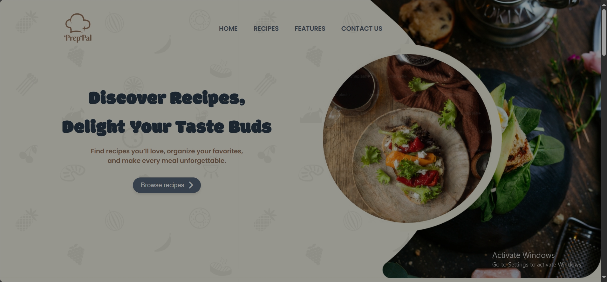

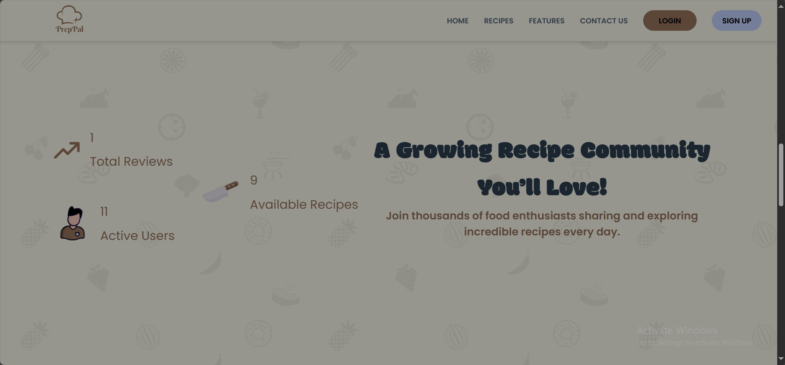
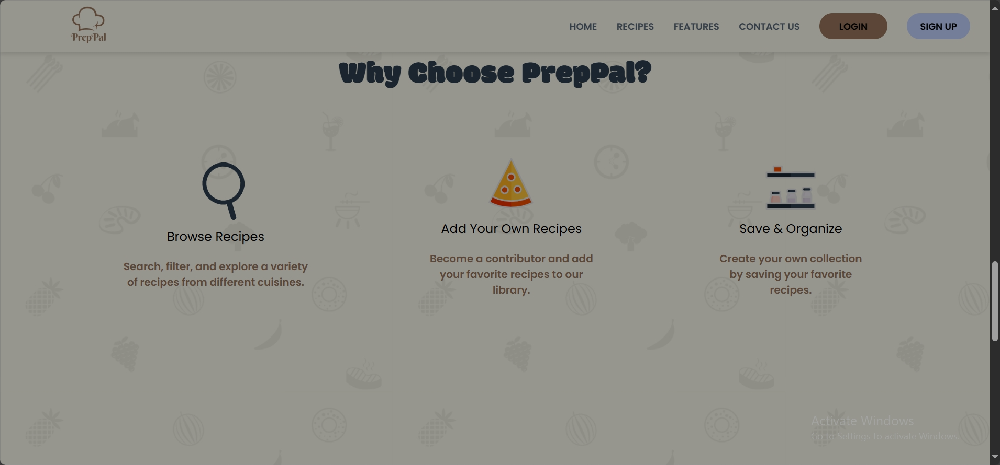

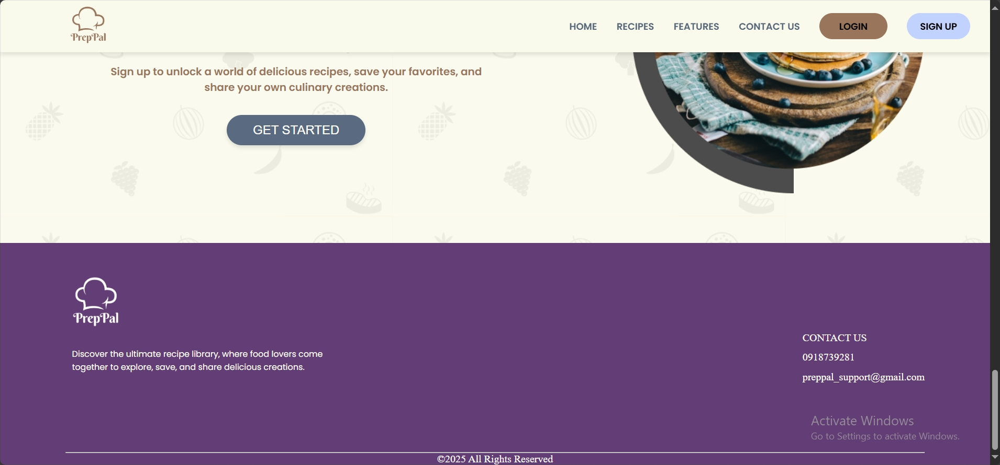

- Animated visuals and floating elements
- Smooth navigation to key sections
- “Browse Recipes” and “Sign Up” CTAs
- Highlighted categories and trending recipes

---

### 👤 User Authentication (Signup & Login)

Secure login and signup system for user access and personalized features.

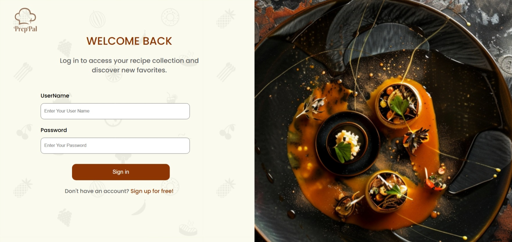 
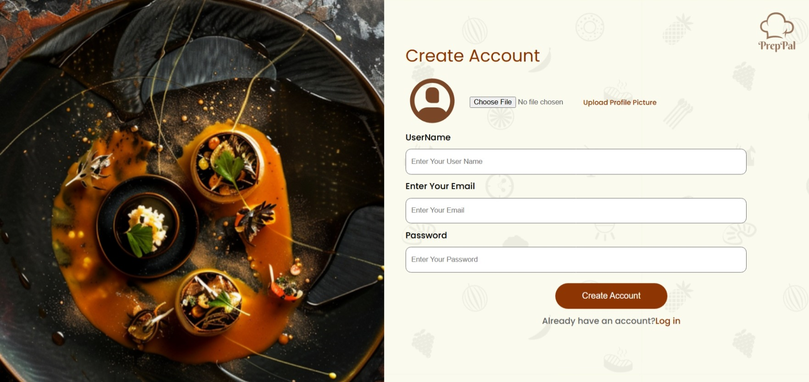

- Backend validation with PHP & MySQL
- Required for saving, liking, and adding recipes

---

### 🍽️ Home Page with Popular Recipes

After logging in, users land on a recipe discovery hub showing community favorites.

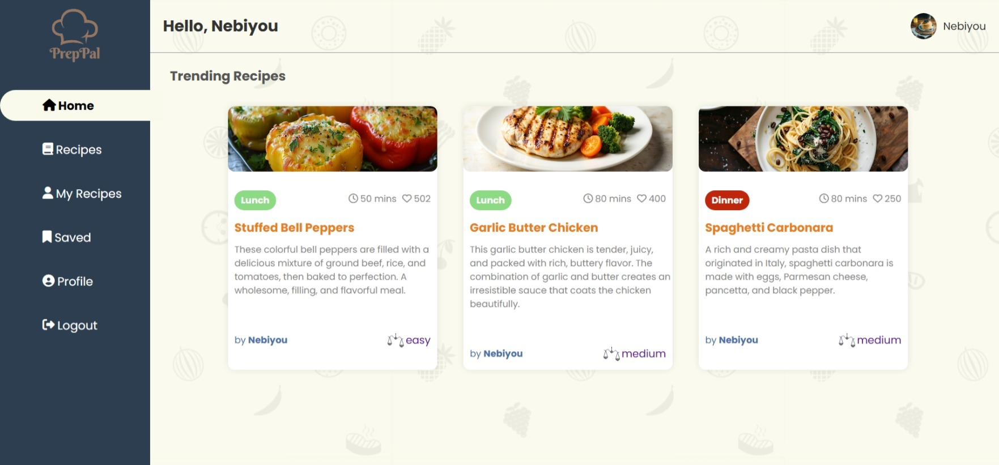

- Featured and liked recipes displayed
- Beautiful card layout with preview info
- Category, duration, and like count shown

---

### 📖 Recipes Page

Dive into any recipe to see full instructions, ingredients, and user interactions.

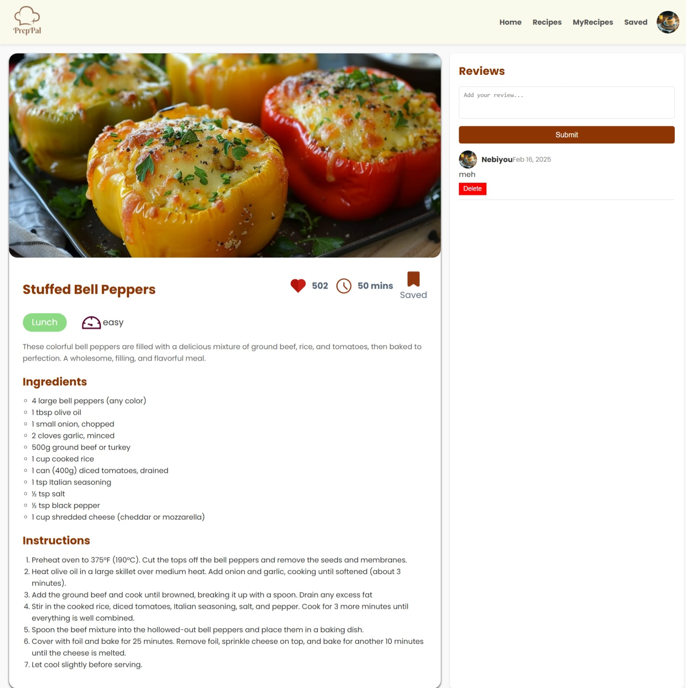

- Full recipe details (title, category, steps, cook time, image)
- Users can **like**, **comment**, and **save** recipes
- Comments are stored and visible per recipe
- Smooth UX for recipe viewing and interactions

---

### 🔎 Browse Recipes

Browse and search through the entire recipe collection with ease.

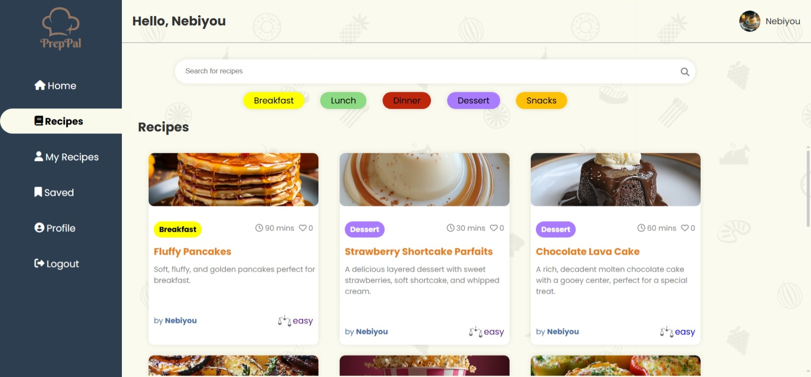

- **Search bar** to find recipes by name
- **Category filters** (Breakfast, Lunch, Dinner, etc.)
- Sort by newest or popularity
- Clean layout with filter buttons and live search functionality

---

### 📂 My Recipes Page

Personal dashboard to manage your own contributions.

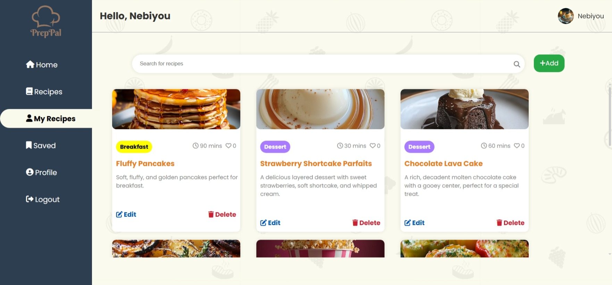

- View all recipes submitted by you
- **Edit** or **delete** your existing recipes
- Quick access to “Add Recipe” form
- Keeps your creations organized and editable

---

### 📝 Add and Edit Recipe Page

Let users become creators! Logged-in users can easily submit or update recipes.

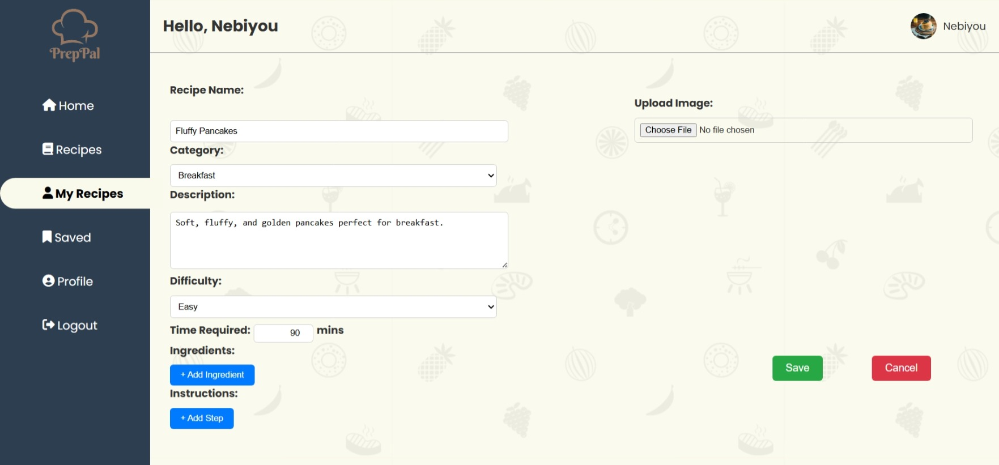

- Upload image, add recipe title, description, ingredients, steps, etc.
- Choose category and input prep/cook time
- Editable after submission via My Recipes

---

### 💾 Save & Organize Recipes

Users can build a collection of their favorite recipes for quick future access.

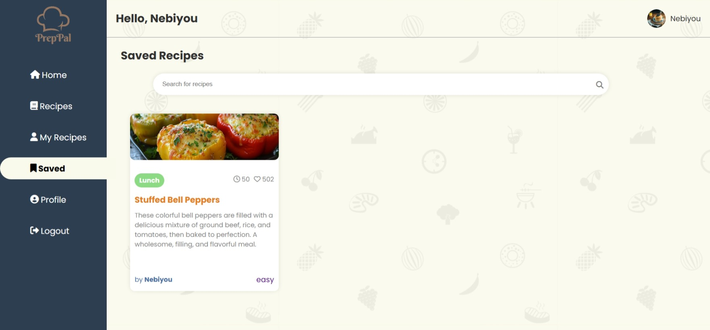

- One-click “Save” functionality on recipe cards
- Personalized saved recipes section
- Recipes persist across sessions

---

### 🛠️ Admin Dashboard

Dedicated panel for admin to manage the ecosystem.

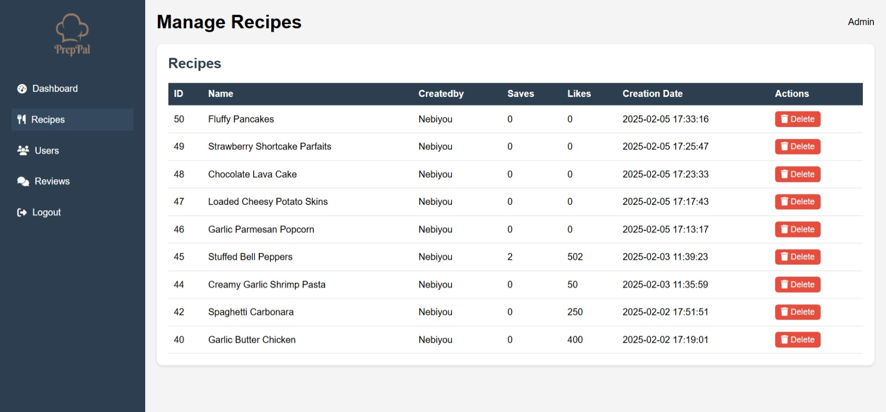

Admins can:
- View and moderate all submitted recipes
- Approve, edit, or delete inappropriate content
- Manage and review user accounts
- Ensure quality and safety of shared content

> 🔐 Admin access is restricted via role-based login

---

## 🙋‍♂️ Author

**Nebiyou Dawit**  
PrepPal is a beginner level personal project made to showcase my passion for full-stack development — combining clean frontend UI with dynamic backend functionality.

---

## 📫 Contact

- 📧 Email: nebiyoudawit21@gmail.com

---

## 📌 Notes

- This is a full-featured **portfolio project**, not intended for commercial use.
- Designed with usability and smooth animations in mind.
- All recipe content is placeholder/demo-based.

---

